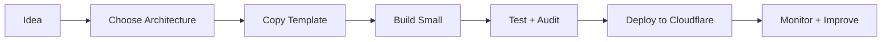

# CloudflareOS

> **A practical operating system for building production-ready applications on Cloudflare.**

[](#roadmap)
[](START-HERE.md)
[](#cloudflare-product-domains)
[](AGENTS.md)
[](#how-to-use-this-repo)

CloudflareOS helps developers, founders, solo builders, and AI coding agents plan, build, debug, deploy, and improve Cloudflare-first apps.

👉 **New here? Start with [`START-HERE.md`](START-HERE.md).**  
🤖 **Using an AI coding agent? Read [`AGENTS.md`](AGENTS.md).**  
🏗️ **Choosing a system design? Browse [`architectures/README.md`](architectures/README.md).**

---

## What is CloudflareOS?

CloudflareOS is a reusable engineering handbook for projects that want to run on Cloudflare.

| Area | What you get |
| --- | --- |
| **Learning** | Beginner-friendly explanations and roadmaps |
| **Architecture** | Reference designs for real application types |
| **Templates** | Reusable configs, folder structures, and starter files |
| **Prompts** | AI-ready build, audit, debug, and deploy prompts |
| **Checklists** | Production readiness, security, and deployment checks |
| **Catalog** | Simple explanations of Cloudflare services |

---

## Build path



---

## Simple Cloudflare toolbox

| Need | Use this |
| --- | --- |
| Website / frontend | Pages or Workers |
| Backend/API | Workers |
| SQL database | D1 |
| File uploads | R2 |
| Small cache/config | KV |
| Background jobs | Queues |
| Long-running business flow | Workflows |
| Shared live state | Durable Objects |
| AI features | Workers AI / AI Gateway |
| Form protection | Turnstile |
| Admin protection | Access |
| Observability | Workers Observability / Logs / Analytics |

---

## What you can build with it

| Project type | Good starting guide |
| --- | --- |
| Blog / CMS | [CMS](architectures/cms.md) |
| News portal | [News Portal](architectures/news-portal.md) |
| AI chat app | [AI Chatbot](architectures/ai-chatbot.md) |
| Marketplace | [Marketplace](architectures/marketplace.md) |
| SaaS app | [Multi-tenant SaaS](architectures/multi-tenant-saas.md) |
| Online store | [E-commerce](architectures/e-commerce.md) |
| Course platform | [LMS](architectures/lms.md) |
| Travel lead platform | [Travel Platform](architectures/travel-platform.md) |
| Real-time app | [Real-time Collaboration](architectures/realtime-collaboration.md) |
| Public API | [API Platform](architectures/api-platform.md) |

---

## How to use this repo

### Learn

Start with [`START-HERE.md`](START-HERE.md), then follow [`docs/02-newcomer-roadmap.md`](docs/02-newcomer-roadmap.md).

### Plan a project

Choose the closest application design in [`architectures/README.md`](architectures/README.md). Start with its smallest useful version before adding advanced services.

### Use with AI coding tools

```text
Read START-HERE.md, AGENTS.md, and the closest guide in architectures/.
Review my project and recommend the simplest Cloudflare-first architecture.
Do not add advanced services unless they are truly needed.
Explain every decision and keep secrets out of source code.
```

### Audit before deployment

Review environment variables, bindings, uploads, secrets, route safety, deployment target, security gaps, monitoring gaps, and rollback readiness. Start with [`docs/production-readiness-checklist.md`](docs/production-readiness-checklist.md) and [`docs/rollback-checklist.md`](docs/rollback-checklist.md).

---

## Repository map

```text
.
├── START-HERE.md              # First page for beginners
├── AGENTS.md                  # AI coding-agent rules
├── ROADMAP.md                 # Public roadmap
├── CONTRIBUTING.md            # Contribution and writing standards
├── docs/                      # Learning guides, principles, checklists
├── catalog/                   # Cloudflare product knowledge
├── architectures/             # Reference application designs
├── playbooks/                 # Project-specific implementation guides
├── examples/                  # Real-world application examples
├── prompts/                   # Build, debug, deploy, and audit prompts
├── templates/                 # Safe reusable starter configs/files
├── scripts/                   # Setup and verification tools
└── .github/workflows/         # Quality checks and update automation
```

---

## Cloudflare product domains

| Domain | Included capabilities |
| --- | --- |
| **Build** | Workers, Pages, Durable Objects, Containers, Queues, Workflows, Browser Rendering, Wrangler |
| **Data** | D1, R2, Workers KV, Hyperdrive, Vectorize, Analytics Engine, Pipelines |
| **AI** | Workers AI, AI Gateway, Agents, AI Search, Vectorize |
| **Media** | Images, Stream, Realtime, Image Transformations |
| **Security** | WAF, Turnstile, API Shield, Bot Management, Rate Limiting, SSL/TLS |
| **Zero Trust** | Access, Gateway, Tunnel, WARP, Browser Isolation, DLP |
| **Network & Delivery** | DNS, CDN, Cache Rules, Argo, Load Balancing, Waiting Room, Spectrum |
| **Observe** | Workers Observability, Logs, Analytics, Web Analytics, Health Checks, Audit Logs |

---

## Design principles

- **Simple first:** start with the smallest working architecture.
- **Cloudflare-first:** use Cloudflare services when they fit the job.
- **Production-aware:** think about security, data, deploys, and monitoring early.
- **Beginner-safe:** explain decisions in plain language before deep engineering detail.
- **AI-ready:** write instructions clearly enough for coding agents to follow.
- **Freshness-aware:** verify changing Cloudflare facts against official sources.

More principles: [`docs/09-project-principles.md`](docs/09-project-principles.md)

---

## Roadmap

See the detailed plan in [`ROADMAP.md`](ROADMAP.md).

| Version | Focus | Status |
| --- | --- | --- |
| **v0.1** | Foundation — beginner path, agent rules, core guidance | ✅ Complete |
| **v0.2** | Project Engine — playbooks, templates, and prompts | 🚧 In progress |
| **v0.3** | Cloudflare Product Catalog | 🚧 In progress |
| **v0.4** | Production Assistant — deployment, security, operations | 🚧 In progress |
| **v0.5** | Living Knowledge Engine — update watching and freshness checks | ⏳ Planned |
| **v1.0** | Public stable handbook, templates, and examples | 🎯 Future |

**Currently building:** architecture patterns, catalog coverage, practical playbooks, starter examples, production checklists, and a freshness system for changing Cloudflare guidance.

---

## Contributing

CloudflareOS is beginner-first and production-aware. Before adding guides, read [`CONTRIBUTING.md`](CONTRIBUTING.md).

Good contributions should be simple, useful for real projects, justified, safe for production, and clear enough for AI coding agents.

---

## The promise

> Make Cloudflare engineering simple enough for beginners and strong enough for production.
