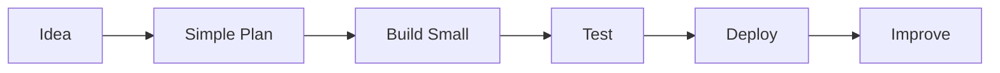

# Cloudflare Engineering OS

> **Build Cloudflare apps step by step — from beginner to production.**

[](#roadmap) [](START-HERE.md) [](#cloudflare-product-domains) [](AGENTS.md)

Cloudflare Engineering OS helps people and AI coding tools plan, build, debug, deploy, and improve apps using Cloudflare.

You do **not** need to be an expert to start.

👉 **New here? Start with [`START-HERE.md`](START-HERE.md).**



## What this project does

It helps you answer simple questions:

- What should I build first?
- Which Cloudflare tool should I use?
- Where does my data go?
- How do I upload files?
- How do I deploy safely?
- How do I fix common errors?
- How do I know my project is ready?

Advanced users also get service decision guides, architecture patterns, AI-agent rules, production scorecards, and update automation.

## Simple Cloudflare toolbox

| Need | Use this |
| --- | --- |
| Website page | Pages |
| Backend/API code | Workers |
| Database | D1 |
| File upload | R2 |
| Small cache | KV |
| Background task | Queues |
| Step-by-step business process | Workflows |
| AI feature | Workers AI |
| Protect a form | Turnstile |
| Protect admin area | Access |

## What it helps you build

| Project | Beginner stack |
| --- | --- |
| Blog / CMS | Pages or Workers, D1, R2 |
| News portal | Workers, D1, R2, Turnstile |
| AI chat | Workers, Workers AI, D1 |
| File manager | Workers, R2, D1 |
| Admin tool | Workers, D1, Access |
| Marketplace | Workers, D1, R2, Queues |

## Start path

1. Read [`START-HERE.md`](START-HERE.md).
2. Read [`docs/02-newcomer-roadmap.md`](docs/02-newcomer-roadmap.md).
3. Build one small project first.
4. Deploy it.
5. Add advanced Cloudflare services only when needed.

## For AI coding agents

Give your AI tool this instruction:

```text
Read START-HERE.md and AGENTS.md. I am a beginner. Explain each step simply. Do not add advanced Cloudflare services unless needed.
```

## Cloudflare product domains

| Domain | Included capabilities |
| --- | --- |
| **Build** | Workers, Pages, Durable Objects, Containers, Queues, Workflows, Browser Rendering, Email Workers, Wrangler |
| **Data** | D1, R2, R2 Data Catalog, Workers KV, Hyperdrive, Vectorize, Analytics Engine, Pipelines |
| **AI** | Workers AI, AI Gateway, Agents, AI Search, Vectorize |
| **Media** | Images, Stream, Realtime, Image Transformations |
| **Security** | WAF, Turnstile, API Shield, Bot Management, Rate Limiting, SSL/TLS |
| **Zero Trust** | Access, Gateway, Tunnel, WARP, Browser Isolation, DLP |
| **Network & Delivery** | DNS, CDN, Cache Rules, Argo, Load Balancing, Waiting Room, Spectrum |
| **Observe** | Workers Observability, Logs, Analytics, Web Analytics, Health Checks, Audit Logs |

## Design principles

- **Simple first:** beginners should never face advanced architecture on page one.
- **Cloudflare-first:** use Cloudflare tools when they fit the job.
- **Small steps:** build a working small version before adding complexity.
- **Safe by default:** protect secrets, data, admin areas, and deployments.
- **Two levels:** every major topic should have a simple explanation and an engineering explanation.

## Roadmap

- [x] Product vision and first README
- [x] AI agent operating rules
- [x] Newcomer roadmap
- [x] Cloudflare decision engine
- [x] Production readiness scorecard
- [ ] Beginner glossary
- [ ] Secure Mini CMS reference application
- [ ] Complete Cloudflare service catalog
- [ ] Cloudflare update watcher
- [ ] Debug playbook library

## Repository map

```text
.
├── START-HERE.md              # First page for beginners
├── AGENTS.md                  # AI coding-agent rules
├── docs/                      # Guides and roadmaps
├── catalog/                   # Cloudflare product knowledge
├── architectures/             # Reference application designs
├── prompts/                   # Build, debug, deploy, audit prompts
├── templates/                 # Safe reusable configurations
├── scripts/                   # Setup and verification tools
└── .github/workflows/         # Quality checks and update automation
```

## The promise

> Make Cloudflare engineering simple enough for beginners and strong enough for production.
