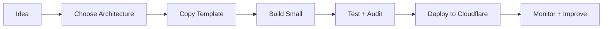

# CloudflareOS

> **A practical operating system for building production-ready applications on Cloudflare.**

[](#roadmap)
[](START-HERE.md)
[](#cloudflare-product-domains)
[](AGENTS.md)
[](#how-to-use-this-repo)

CloudflareOS helps developers, founders, solo builders, and AI coding agents plan, build, debug, deploy, and improve Cloudflare-first apps.

You do **not** need to be a Cloudflare expert to start.

👉 **New here? Start with [`START-HERE.md`](START-HERE.md).**  
🤖 **Using an AI coding agent? Read [`AGENTS.md`](AGENTS.md).**

---

## What is CloudflareOS?

CloudflareOS is not one application. It is a reusable engineering handbook for projects that want to run on Cloudflare.

It gives you:

| Area | What you get |
| --- | --- |
| **Learning** | Beginner-friendly explanations and roadmaps |
| **Architecture** | Clear patterns for real apps |
| **Templates** | Reusable configs, folder structures, and starter files |
| **Prompts** | AI-ready build, audit, debug, and deploy prompts |
| **Checklists** | Production readiness, security, and deployment checks |
| **Catalog** | Simple explanations of Cloudflare services |

---

## Build path



---

## What this helps you answer

- What should I build first?
- Which Cloudflare service should I use?
- Should this use Workers, Pages, D1, R2, KV, Queues, or Durable Objects?
- Where should my database, uploads, cache, and background jobs go?
- How do I deploy safely?
- How do I debug common Cloudflare errors?
- How do I make an AI coding agent follow my Cloudflare-first rules?
- How do I know my project is production-ready?

---

## Simple Cloudflare toolbox

| Need | Use this |
| --- | --- |
| Website / frontend | Pages or Workers |
| Backend/API | Workers |
| SQL database | D1 |
| File uploads | R2 |
| Small cache/config | KV |
| Background jobs | Queues |
| Long-running business flow | Workflows |
| Shared live state | Durable Objects |
| AI features | Workers AI / AI Gateway |
| Form protection | Turnstile |
| Admin protection | Access |
| Observability | Workers Observability / Logs / Analytics |

---

## What you can build with it

| Project type | Good starting stack |
| --- | --- |
| Blog / CMS | Pages or Workers + D1 + R2 |
| News portal | Workers + D1 + R2 + Turnstile |
| AI chat app | Workers + Workers AI + D1 |
| File manager | Workers + R2 + D1 |
| Admin dashboard | Workers + D1 + Access |
| Marketplace | Workers + D1 + R2 + Queues |
| Server-side tracking | Workers + Queues + Analytics Engine |
| SaaS app | Workers + D1 + R2 + Queues + Access |

---

## How to use this repo

### 1. Use it as a learning guide

Start here:

```text
START-HERE.md
```

Then follow:

```text
docs/02-newcomer-roadmap.md
```

### 2. Use it inside another project

Copy only the guide, prompt, or template you need.

```text
CloudflareOS/templates/example
↓
your-project/
```

Do **not** copy the whole repository into every project unless you want it as a reference folder.

### 3. Use it with AI coding tools

Give your AI tool this instruction:

```text
Read START-HERE.md and AGENTS.md from CloudflareOS.
Review my project and recommend the simplest Cloudflare-first architecture.
Do not add advanced services unless they are truly needed.
Explain every step clearly.
```

### 4. Use it as an audit checklist

Before deployment, use the production readiness guides and prompts to check:

- environment variables
- database bindings
- R2 buckets
- secrets
- route safety
- upload rules
- build command
- deployment target
- security gaps
- monitoring gaps

---

## Repository map

```text
.
├── START-HERE.md              # First page for beginners
├── AGENTS.md                  # AI coding-agent rules
├── ROADMAP.md                 # Public roadmap
├── CONTRIBUTING.md            # Contribution and writing standards
├── docs/                      # Learning guides, principles, checklists
├── catalog/                   # Cloudflare product knowledge
├── architectures/             # Reference application designs
├── prompts/                   # Build, debug, deploy, and audit prompts
├── templates/                 # Safe reusable starter configs/files
├── scripts/                   # Setup and verification tools
└── .github/workflows/         # Quality checks and update automation
```

---

## Cloudflare product domains

| Domain | Included capabilities |
| --- | --- |
| **Build** | Workers, Pages, Durable Objects, Containers, Queues, Workflows, Browser Rendering, Email Workers, Wrangler |
| **Data** | D1, R2, R2 Data Catalog, Workers KV, Hyperdrive, Vectorize, Analytics Engine, Pipelines |
| **AI** | Workers AI, AI Gateway, Agents, AI Search, Vectorize |
| **Media** | Images, Stream, Realtime, Image Transformations |
| **Security** | WAF, Turnstile, API Shield, Bot Management, Rate Limiting, SSL/TLS |
| **Zero Trust** | Access, Gateway, Tunnel, WARP, Browser Isolation, DLP |
| **Network & Delivery** | DNS, CDN, Cache Rules, Argo, Load Balancing, Waiting Room, Spectrum |
| **Observe** | Workers Observability, Logs, Analytics, Web Analytics, Health Checks, Audit Logs |

---

## Design principles

- **Simple first:** start with the smallest working architecture.
- **Cloudflare-first:** use Cloudflare services when they fit the job.
- **Production-aware:** think about security, data, deploys, and monitoring early.
- **Beginner-safe:** explain decisions in plain language before deep engineering detail.
- **AI-ready:** write instructions clearly enough for coding agents to follow.
- **Copy responsibly:** templates should be adapted, not blindly pasted.

More principles: [`docs/09-project-principles.md`](docs/09-project-principles.md)

---

## Roadmap

See the full roadmap in [`ROADMAP.md`](ROADMAP.md).

- [x] Product vision and public README
- [x] AI agent operating rules
- [x] Newcomer roadmap
- [x] Cloudflare decision engine
- [x] Production readiness scorecard
- [x] Beginner glossary
- [x] Secure Mini CMS reference architecture
- [x] Cloudflare update watcher foundation
- [x] Debug playbook library foundation
- [ ] Complete Cloudflare service catalog
- [ ] Add more starter templates
- [ ] Add real-world example apps
- [ ] Add server-side tracking architecture

---

## Contributing

CloudflareOS is beginner-first and production-aware. Before adding guides, read [`CONTRIBUTING.md`](CONTRIBUTING.md).

Good contributions should be:

- simple enough for beginners
- useful for real projects
- Cloudflare-first but not blindly Cloudflare-only
- safe for production use
- clear enough for AI coding agents

---

## The promise

> Make Cloudflare engineering simple enough for beginners and strong enough for production.
