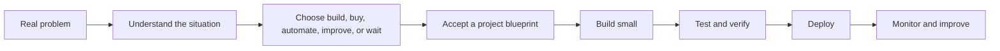

# DeveloperB

> **From real problems to build-ready products.**

DeveloperB helps founders, clients, team members, and developers turn a real-world problem into a clear decision, useful documentation, a project blueprint, and a verified path to build.

DeveloperB is an independent product. The source repository and deployment configuration are technical implementation details that are being migrated separately. Cloudflare is referenced only as infrastructure and technical knowledge where appropriate; DeveloperB does not imply a partnership, sponsorship, or endorsement.

[](WORKSPACE.md)
[](private-alpha/README.md)
[](AGENTS.md)
[](#cloudflare-friendly-toolkit)

## DeveloperB private alpha

A person should be able to say:

> “This is the problem I face every day. I do not know whether I need a tool, a process change, automation, or a full product.”

DeveloperB guides the next decision:

```text
Natural language problem
→ confirmed facts, assumptions, and unanswered questions
→ solution options
→ recommendation and what not to build yet
→ accepted project blueprint
→ build workspace, tasks, AI guidance, evidence, and delivery
```

DeveloperB does not assume that a custom product is always the answer. It considers:

- Do not build yet
- Use an existing tool
- Improve the manual process
- Automate one workflow
- Build a lightweight internal tool
- Build a full software product

Start the private workspace at [`WORKSPACE.md`](WORKSPACE.md). Product architecture, data model, and build order are in [`private-alpha/README.md`](private-alpha/README.md).

## Cloudflare-friendly toolkit

This repository includes practical guidance for building and operating applications with Cloudflare services when they fit the technical need.

| Area | What you get |
| --- | --- |
| Learning | Beginner-friendly explanations and roadmaps |
| Architecture | Reference designs for real application types |
| Templates | Reusable configs, folder structures, and starter files |
| Prompts | AI-ready build, audit, debug, and deploy prompts |
| Checklists | Production readiness, security, and deployment checks |
| Catalog | Simple explanations of Cloudflare services |

👉 **New here? Start with [`START-HERE.md`](START-HERE.md).**  
🤖 **Using an AI coding agent? Read [`AGENTS.md`](AGENTS.md).**  
🏗️ **Choosing a system design? Browse [`architectures/README.md`](architectures/README.md).**

## Build path



## Common Cloudflare services

| Need | Common service |
| --- | --- |
| Website / frontend | Pages or Workers |
| Backend/API | Workers |
| SQL database | D1 |
| File uploads | R2 |
| Small cache/config | KV |
| Background jobs | Queues |
| Long-running business flow | Workflows |
| Shared live state | Durable Objects |
| AI features | Workers AI / AI Gateway |
| Form protection | Turnstile |
| Internal access | Access |
| Observability | Workers Observability / Logs / Analytics |

## What you can build with it

| Project type | Good starting guide |
| --- | --- |
| Blog / CMS | [CMS](architectures/cms.md) |
| News portal | [News Portal](architectures/news-portal.md) |
| AI chat app | [AI Chatbot](architectures/ai-chatbot.md) |
| Marketplace | [Marketplace](architectures/marketplace.md) |
| SaaS app | [Multi-tenant SaaS](architectures/multi-tenant-saas.md) |
| Online store | [E-commerce](architectures/ecommerce.md) |
| Course platform | [LMS](architectures/lms.md) |
| Travel lead platform | [Travel Platform](architectures/travel-platform.md) |
| Real-time app | [Real-time Collaboration](architectures/realtime-collaboration.md) |
| Public API | [API Platform](architectures/api-platform.md) |

## Use with AI coding tools

```text
Read BUILD-STATUS.md, WORKSPACE-STATUS.md, AGENTS.md, and the closest architecture guide.
Start from the real problem.
Separate confirmed facts, assumptions, and unanswered questions.
Consider build, buy, automate, process improvement, and do-not-build options.
Create a project only after an accepted blueprint.
Keep secrets out of source code and verify every important decision.
```

## Audit before deployment

Review environment variables, bindings, uploads, secrets, route safety, deployment target, security gaps, monitoring gaps, and rollback readiness. Start with [`docs/production-readiness-checklist.md`](docs/production-readiness-checklist.md) and [`docs/rollback-checklist.md`](docs/rollback-checklist.md).

## Repository map

```text
.
├── WORKSPACE.md                # DeveloperB private-alpha workspace guide
├── private-alpha/              # Problem-to-product data model and migration guidance
├── START-HERE.md               # Beginner path
├── AGENTS.md                   # Engineering and AI-agent rules
├── ROADMAP.md                  # Roadmap
├── docs/                       # Learning guides, principles, checklists
├── catalog/                    # Cloudflare technical knowledge
├── architectures/              # Reference application designs
├── playbooks/                  # Project-specific implementation guides
├── examples/                   # Real-world application examples
├── prompts/                    # Build, debug, deploy, and audit prompts
├── templates/                  # Safe reusable starter configs/files
├── scripts/                    # Setup and verification tools
└── .github/workflows/          # Quality checks and update automation
```

## Design principles

- **Problem first:** understand the lived problem before proposing a product.
- **Simple first:** start with the smallest working solution.
- **Provider-neutral product:** choose infrastructure based on technical fit; do not imply affiliation.
- **Production-aware:** think about security, data, deploys, and monitoring early.
- **Beginner-safe:** explain decisions in plain language before deep engineering detail.
- **AI-ready:** write instructions clearly enough for coding agents to follow.
- **Freshness-aware:** verify changing provider facts against official sources.

More principles: [`docs/09-project-principles.md`](docs/09-project-principles.md)

## Contributing

DeveloperB and the toolkit should be useful for real projects, justified, safe, clear about uncertainty, and understandable by both people and AI coding agents. Read [`CONTRIBUTING.md`](CONTRIBUTING.md) before adding guides.

## The promise

> Help people move from real problems to build-ready products without wasting developer time, money, or AI effort.
