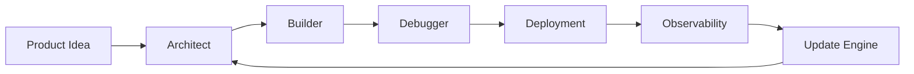

# Cloudflare Engineering OS

> **Build Cloudflare-native applications like a senior platform engineer.**

[](#roadmap) [](#cloudflare-product-domains) [](AGENTS.md) [](LICENSE)

Cloudflare Engineering OS is an AI-ready engineering system for planning, architecting, building, debugging, deploying, securing, monitoring, and continuously improving Cloudflare-native applications.



## What this is

This is **not** a starter template.

It is a practical engineering operating system that combines:

- Cloudflare product knowledge and selection guidance
- AI coding-agent rules for Codex, Cursor, Claude Code, Gemini, and ChatGPT
- Production reference architectures
- Security, performance, cost, and deployment checklists
- Debug playbooks based on root causes—not vague fixes
- A review-first update system for Cloudflare product changes

## What it helps you build

| Build type | Typical Cloudflare stack |
| --- | --- |
| CMS / News Portal | Workers, D1, R2, KV, Queues, Turnstile, WAF |
| SaaS / CRM / ERP | Workers, D1, Durable Objects, R2, Queues, Workflows, Access |
| AI App / RAG | Workers AI, AI Gateway, Vectorize, D1, R2, Workers |
| Marketplace | Workers, D1, R2, Queues, Workflows, Turnstile, API Shield |
| Media Platform | Images, Stream, R2, Workers, Cache Rules, Web Analytics |
| Internal Tool | Workers, D1, Access, Tunnel, Gateway, Audit Logs |

## Cloudflare product domains

| Domain | Included capabilities |
| --- | --- |
| **Build** | Workers, Pages, Durable Objects, Containers, Queues, Workflows, Browser Rendering, Email Workers, Wrangler |
| **Data** | D1, R2, R2 Data Catalog, Workers KV, Hyperdrive, Vectorize, Analytics Engine, Pipelines |
| **AI** | Workers AI, AI Gateway, Agents, AI Search, Vectorize |
| **Media** | Images, Stream, Realtime, Image Transformations |
| **Security** | WAF, Turnstile, API Shield, Bot Management, Rate Limiting, SSL/TLS |
| **Zero Trust** | Access, Gateway, Tunnel, WARP, Browser Isolation, DLP |
| **Network & Delivery** | DNS, CDN, Cache Rules, Argo, Load Balancing, Waiting Room, Spectrum |
| **Observe** | Workers Observability, Logs, Analytics, Web Analytics, Health Checks, Audit Logs |

## Quick start

### For people

1. Start with [`docs/00-product-charter.md`](docs/00-product-charter.md).
2. Read the [`newcomer roadmap`](docs/02-newcomer-roadmap.md).
3. Choose a pattern from `architectures/`.
4. Use the production readiness checklist before deployment.

### For AI coding agents

1. Give the agent [`AGENTS.md`](AGENTS.md).
2. Ask it to inspect the project before proposing changes.
3. Require an architecture decision before adding Cloudflare services.
4. Require the deployment and safety checklist before production changes.

## Design principles

- **Cloudflare-native first:** use a Cloudflare product when it fits the requirement.
- **Simple before clever:** start with the smallest reliable architecture.
- **Production-safe by default:** no destructive database action without a recovery plan.
- **Explain trade-offs:** every recommended service must say why it fits and what it costs.
- **Review before trust:** automated Cloudflare knowledge updates must arrive as reviewable pull requests.

## Roadmap

- [x] Product vision and first README
- [ ] AI agent operating rules
- [ ] Complete Cloudflare service catalog
- [ ] Architecture decision engine
- [ ] Production readiness scorecard
- [ ] Secure Mini CMS reference application
- [ ] Cloudflare update watcher
- [ ] Debug playbook library

## Repository map

```text
.
├── AGENTS.md                  # AI coding-agent operating rules
├── docs/                      # Product charter and onboarding
├── catalog/                   # Cloudflare product knowledge
├── architectures/             # Reference application designs
├── prompts/                   # Build, debug, deploy, audit prompts
├── templates/                 # Safe reusable configurations
├── scripts/                   # Setup and verification tools
└── .github/workflows/         # Quality checks and update automation
```

## The promise

> Do not just explain Cloudflare. Teach people—and AI agents—how to engineer with it.
