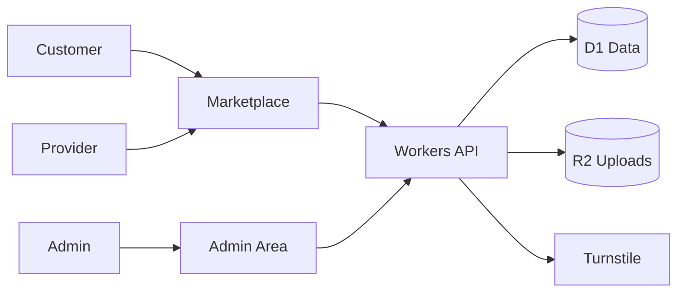

# Project Playbook: Marketplace

Use this when someone says:

> I need to develop a marketplace.

## Simple goal

Build a platform where sellers or service providers can list offers and customers can request or buy them.

## Version 1 only

Start small.

- Public homepage
- Provider/seller profile
- Listing page
- Customer request form
- Admin review area
- Basic status tracking
- File or image upload
- Deploy to Cloudflare

## Do not build these first

Add later only after version 1 works:

- Escrow payments
- Full chat system
- Complex dispute system
- Mobile app
- Recommendation engine
- Advanced search
- Multi-country operations

## Cloudflare tools

| Need | Cloudflare tool | Beginner reason |
| --- | --- | --- |
| Website | Pages or Workers | Shows public marketplace |
| Backend/API | Workers | Handles listings and requests |
| Database | D1 | Stores users, listings, requests |
| Images/files | R2 | Stores provider photos and attachments |
| Form protection | Turnstile | Reduces spam |
| Admin protection | Access or login | Keeps review area private |
| Background work later | Queues | Sends notifications later |
| Process flow later | Workflows | Handles approval/order flow later |
| Logs | Workers Logs | Helps debug problems |

## Beginner architecture



## First database tables

```text
providers
- id
- name
- email
- phone
- status
- created_at
- updated_at

listings
- id
- provider_id
- title
- description
- price
- status
- image_key
- created_at
- updated_at

requests
- id
- listing_id
- customer_name
- customer_contact
- message
- status
- created_at
```

## Build steps

1. Create the project.
2. Build public homepage.
3. Create D1 tables.
4. Build provider profile and listing pages.
5. Add customer request form.
6. Add Turnstile to the form.
7. Add image upload to R2.
8. Build admin review page.
9. Test locally.
10. Deploy to Cloudflare.

## Important beginner choices

- Product marketplace or service marketplace?
- Do users need accounts in version 1?
- Will payments happen inside the platform later?

## Version 2 ideas

- Provider verification
- Reviews
- Messaging
- Payment integration
- Dispute flow
- Search and filters
- Notifications

## AI agent instruction

Do not start with payments, chat, or disputes. First build a simple request-based marketplace that works.
