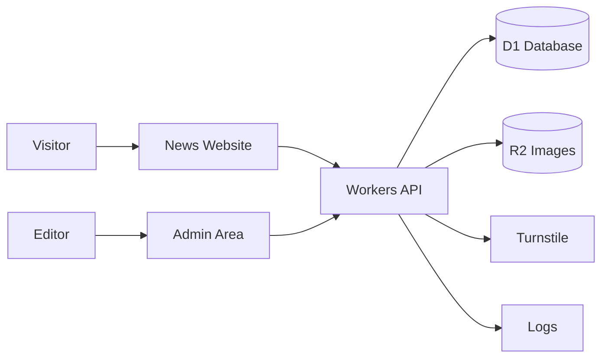

# Project Playbook: News Portal

Use this when someone says:

> I need to develop a news portal.

## Simple goal

Build a website where editors can publish news and visitors can read it.

## Version 1 only

Start small. Version 1 should include:

- Homepage
- News article page
- Category page
- Admin area
- Create, edit, publish, and unpublish article
- Upload article image
- SEO title and description
- Basic contact or report form
- Cloudflare deployment

## Do not build these first

These can come later:

- Mobile app
- Paid subscription
- Live video
- Complex newsroom workflow
- Advanced analytics dashboard
- AI auto-writing
- Multi-language workflow
- Multi-tenant SaaS mode

## Cloudflare tools

| Need | Cloudflare tool | Beginner reason |
| --- | --- | --- |
| Website | Pages or Workers | Shows the public site |
| Backend/API | Workers | Handles article create/edit/read actions |
| Database | D1 | Stores articles, categories, authors |
| Images | R2 | Stores uploaded article images |
| Admin protection | Access or custom login | Keeps admin area private |
| Public form protection | Turnstile | Reduces spam |
| Background jobs later | Queues | For email, image processing, notifications |
| Logs | Workers Logs | Helps debug errors |
| Visitor analytics | Web Analytics | Shows traffic without heavy setup |

## Beginner architecture



## First database tables

Keep the first database simple.

```text
articles
- id
- title
- slug
- excerpt
- body
- status
- category_id
- author_id
- cover_image_key
- seo_title
- seo_description
- published_at
- created_at
- updated_at

categories
- id
- name
- slug
- description

authors
- id
- name
- email
- role
```

## First folder structure

```text
news-portal/
├── app/
│   ├── page.tsx
│   ├── articles/[slug]/page.tsx
│   ├── categories/[slug]/page.tsx
│   └── admin/
├── worker/
│   └── index.ts
├── db/
│   └── migrations/
├── public/
├── wrangler.toml
└── README.md
```

## Build steps

1. Create the project.
2. Build homepage with sample articles.
3. Add article details page.
4. Create D1 database and article tables.
5. Connect Workers API to D1.
6. Build admin create/edit form.
7. Upload images to R2.
8. Protect admin area.
9. Add Turnstile to public forms.
10. Test locally.
11. Deploy to Cloudflare.
12. Add logs and analytics.

## Important beginner choices

### One language or two?

Start with one language first. Add Bangla/English support after publishing works.

### One admin or many authors?

Start with one admin. Add roles later.

### Comments or no comments?

Skip comments in version 1 unless the project truly needs them. Comments add moderation and spam problems.

## Version 2 ideas

After version 1 works:

- Multiple authors
- Draft review workflow
- Breaking news ticker
- Newsletter
- Search
- Related articles
- Image optimization
- RSS feed
- Sitemap
- AI summary helper

## AI agent instruction

When building this project, the agent must not add advanced services until version 1 works. Every step should be small, tested, and explained in simple language.
