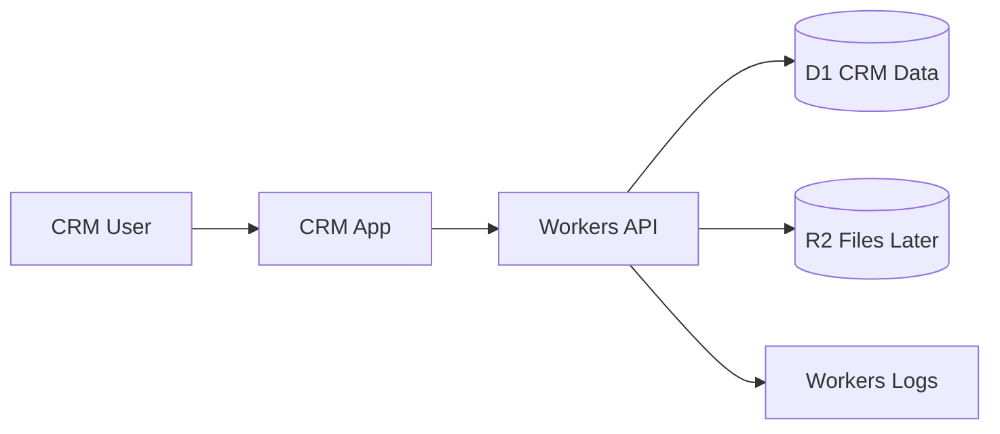

# Project Playbook: SaaS CRM

Use this when someone says:

> I need to develop a CRM or SaaS app.

## Simple goal

Build an app where a business can manage customers, leads, notes, and follow-ups.

## Version 1 only

Start with one simple business account.

- Login/admin area
- Customer list
- Lead list
- Add/edit customer
- Add notes
- Follow-up date
- Simple dashboard
- Deploy to Cloudflare

## Do not build these first

Add later only after version 1 works:

- Multi-tenant billing
- Complex permissions
- Automation builder
- Email campaign system
- Mobile app
- Advanced analytics
- AI sales assistant

## Cloudflare tools

| Need | Cloudflare tool | Beginner reason |
| --- | --- | --- |
| App frontend | Pages or Workers | Shows the app UI |
| Backend/API | Workers | Handles CRM actions |
| Database | D1 | Stores customers, leads, notes |
| File attachments later | R2 | Stores uploaded files |
| Admin/internal protection | Access or login | Keeps app private |
| Background reminders later | Queues | Sends reminders later |
| Multi-step follow-up later | Workflows | Handles longer business processes |
| Logs | Workers Logs | Helps debug problems |

## Beginner architecture



## First database tables

```text
customers
- id
- name
- email
- phone
- company
- status
- created_at
- updated_at

leads
- id
- name
- email
- phone
- source
- status
- follow_up_at
- created_at
- updated_at

notes
- id
- related_type
- related_id
- note
- created_at
```

## Build steps

1. Create the project.
2. Build login or protect with Access.
3. Create D1 database.
4. Create customer and lead tables.
5. Build customer list and create form.
6. Build lead list and follow-up field.
7. Add notes.
8. Test locally.
9. Deploy to Cloudflare.
10. Add reminders later.

## Important beginner choices

- One company or many companies?
- One user or multiple staff?
- Do you need file attachments in version 1?

## Version 2 ideas

- User roles
- Team members
- Customer import
- Email reminders
- Lead pipeline board
- Reports
- Billing/subscription

## AI agent instruction

Start with one-company CRM. Do not build full SaaS billing or complex multi-tenancy until the simple CRM works.
