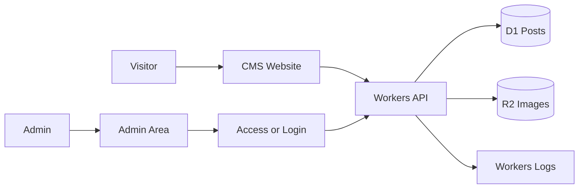

# Project Playbook: Secure Mini CMS

This is the best first training project for Cloudflare Engineering OS.

## Simple goal

Build a small content website where an admin can create posts, upload images, and publish pages safely.

## Why this project first?

A Mini CMS teaches the most important Cloudflare basics without becoming too big:

- Public website
- Admin area
- Database
- File upload
- Form protection
- Deployment
- Logs

After this, a beginner can understand a news portal, blog, course site, or business website more easily.

## Version 1 only

Build only this first:

- Public homepage
- Public post page
- Admin login or Access-protected admin
- Create/edit/delete posts
- Upload cover image
- Publish/unpublish post
- SEO title and description
- Deploy to Cloudflare

## Do not build these first

Add later only after version 1 works:

- Multi-author workflow
- Comments
- Newsletter
- AI writing assistant
- Advanced search
- Complex media library
- Paid content

## Cloudflare tools

| Need | Cloudflare tool | Beginner reason |
| --- | --- | --- |
| Public website | Pages or Workers | Shows the CMS frontend |
| Backend/API | Workers | Handles post actions |
| Database | D1 | Stores posts and metadata |
| Images | R2 | Stores uploaded images |
| Admin protection | Access or login | Keeps admin private |
| Spam protection | Turnstile | Protects public forms |
| Logs | Workers Logs | Helps debug problems |
| Analytics | Web Analytics | Shows visitors |

## Beginner architecture



## First database tables

```text
posts
- id
- title
- slug
- excerpt
- body
- status
- cover_image_key
- seo_title
- seo_description
- published_at
- created_at
- updated_at

settings
- key
- value
- updated_at
```

## First API routes

```text
GET    /api/posts
GET    /api/posts/:slug
POST   /api/admin/posts
PATCH  /api/admin/posts/:id
DELETE /api/admin/posts/:id
POST   /api/admin/uploads
```

## Build steps

1. Create the project.
2. Build a static homepage with sample posts.
3. Create the D1 database.
4. Add the `posts` table.
5. Build the public posts API.
6. Build the admin post form.
7. Add image upload to R2.
8. Protect the admin area.
9. Test locally with Wrangler.
10. Deploy to Cloudflare.
11. Check logs after deploy.

## Beginner success checklist

The project is successful when:

- A visitor can read a post.
- An admin can create a post.
- An admin can upload an image.
- A post can be published and unpublished.
- The project works locally.
- The project deploys to Cloudflare.
- No secrets are written in GitHub.

## Version 2 ideas

- Categories
- Multiple authors
- Draft preview
- RSS feed
- Sitemap
- Search
- AI summary helper
- Queue-based image processing

## AI agent instruction

Keep version 1 very small. Do not add advanced features until the beginner has a working CMS deployed on Cloudflare.
