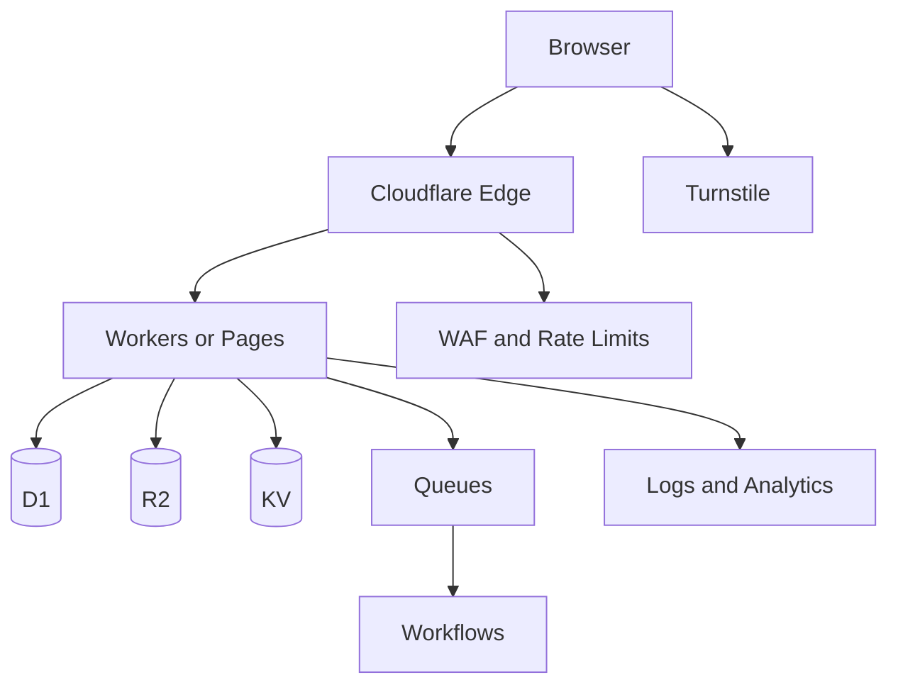

# Cloudflare Product Map

This map is the starting point for architecture decisions. It is intentionally practical: choose services based on workload, data behavior, risk, and operations.

> **Source policy:** verify current product availability, limits, and pricing against official Cloudflare sources before making a production decision.

## Build

| Product | Use it for | Avoid when |
| --- | --- | --- |
| Workers | APIs, edge logic, webhooks, scheduled tasks | Long-running stateful compute without an appropriate runtime design |
| Pages | Frontend/static delivery and frontend-first applications | You need a backend-only service |
| Durable Objects | Coordination, rooms, presence, entity state | Simple CRUD that D1 handles well |
| Queues | Retryable background jobs | Work that must complete in the request response |
| Workflows | Durable multi-step business processes | A one-step async task is enough |
| Containers | Containerized workloads where Workers alone do not fit | A standard Worker can do the job |
| Browser Rendering | Screenshots, PDFs, browser automation | A simple HTTP fetch is sufficient |

## Data

| Product | Use it for | Avoid when |
| --- | --- | --- |
| D1 | Relational app data, content, users, orders | Storing files/blobs or high-coordination real-time state |
| R2 | Uploads, assets, media, exports, backups | Transactional relational records |
| Workers KV | Cache, flags, low-risk session metadata | Strictly consistent transactional source-of-truth data |
| Hyperdrive | Securely accelerate external relational DB access | A new Cloudflare-native D1 design works |
| Vectorize | Semantic search and RAG retrieval | Traditional exact-match relational search only |
| Analytics Engine | High-cardinality event analytics | Primary business transactional data |
| Pipelines | Ingesting event/log data | CRUD application writes |

## AI

| Product | Use it for | Architecture note |
| --- | --- | --- |
| Workers AI | Inference near Workers | Keep prompts/data handling intentional and observable |
| AI Gateway | Provider routing, analytics, caching, controls | Place it between the app and model providers |
| Agents | Stateful AI experiences | Define state, tools, permissions, and cost boundaries |
| AI Search | Search-oriented AI patterns | Pair with clean document ingestion and evaluation |

## Security and access

| Product | Use it for | Minimum practice |
| --- | --- | --- |
| Turnstile | Abuse resistance on forms/auth flows | Always verify tokens server-side |
| WAF | Application attack mitigation | Start with managed rules and tune deliberately |
| API Shield | API discovery/protection | Combine with auth, validation, and rate limits |
| Bot Management | Automated abuse control | Review false-positive impact |
| Access | Internal tools and admin protection | Prefer it before building bespoke admin auth |
| Tunnel | Secure origin connectivity | Keep origin exposure private |

## Delivery and observe

| Product | Use it for | Key question |
| --- | --- | --- |
| Cache Rules / CDN | Faster content delivery | Which responses are safe to cache? |
| Argo | Optimized routing | Is the performance gain worth the cost? |
| Load Balancing | Multi-origin resilience | Do you actually have more than one healthy origin? |
| Waiting Room | Traffic surges | Which user journeys must be protected? |
| Workers Observability / Logs | Runtime diagnostics | Can you trace a failed request safely? |
| Web Analytics | Visitor analytics | What privacy and data boundaries apply? |
| Health Checks | Origin health | What action occurs when a check fails? |

## Default newcomer architecture

Use only the pieces your feature truly needs. Start with Workers + D1 + R2 + Turnstile; add KV, Queues, Workflows, Durable Objects, or AI after identifying the actual workload.
