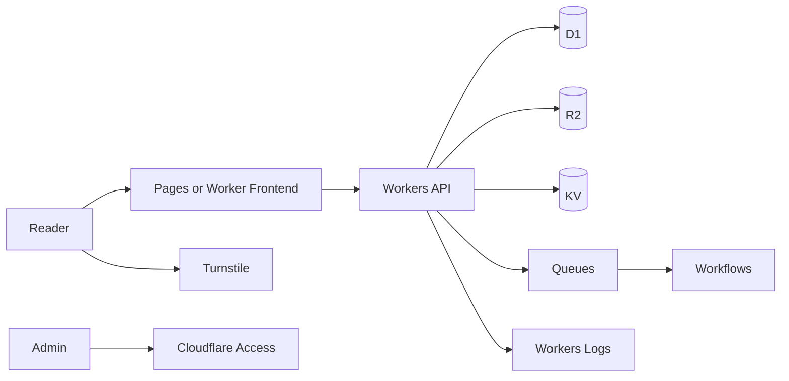

# Newcomer Roadmap

This path helps a newcomer become productive on the Cloudflare stack without adding unnecessary services.

## Stage 1 — Learn the core shape

Start with four services:

- **Workers** for API and backend logic
- **D1** for relational application data
- **R2** for uploads and files
- **Turnstile** for public form protection

Build one small project that has a public page, an API route, a D1 table, and an R2 upload.

## Stage 2 — Add production habits

Add:

- Wrangler environments
- Secrets instead of hard-coded values
- D1 migrations
- Structured error handling
- Request logging
- Rate limits and input validation
- A rollback note before deployment

## Stage 3 — Add scale only when needed

Choose the feature first, then add the service:

| Need | Add |
| --- | --- |
| Cache, flags, low-risk sessions | KV |
| Background email/image/export job | Queues |
| Multi-step durable business process | Workflows |
| Shared live room / presence / coordination | Durable Objects |
| AI assistant or classification | Workers AI + AI Gateway |
| Semantic search / RAG | Vectorize |
| Internal admin protection | Access |

## Stage 4 — Production deployment

Before production, verify:

- Domain and DNS route
- Correct worker environment
- Secrets and bindings
- Database migration status
- Auth and abuse protection
- Cache behavior
- Logs and alerting
- Rollback command or previous deployment path

## First recommended project

Build the **Secure Mini CMS** reference architecture:

It teaches CRUD, files, security, caching, async work, observability, and deployment without creating a confusing architecture.

## Rule for every new service

Before adding a Cloudflare product, answer:

1. What exact requirement does this solve?
2. Why are existing services insufficient?
3. What binding/configuration is required?
4. What failure mode does it introduce?
5. How will we test and observe it?
