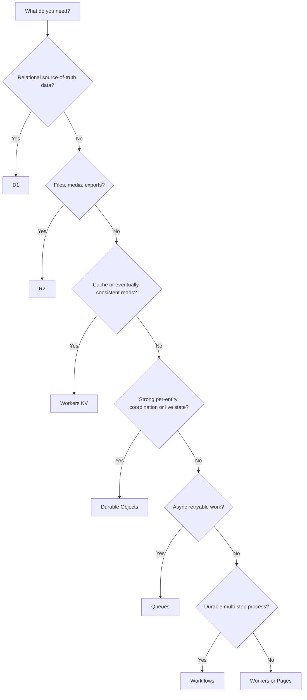

# Cloudflare Decision Engine

Use this guide before choosing a service. Start with the workload, not the product name.

## Decision flow



## Decision cards

### D1 vs KV

Choose **D1** when data is relational, authoritative, queried by multiple fields, or must be migrated safely.

Choose **KV** when data is cache-like, eventually consistent, low-risk, and keyed for simple reads.

Do not use KV as the only transactional record for orders, balances, permissions, or critical user data.

### D1 vs Durable Objects

Choose **D1** for standard relational CRUD and reporting.

Choose **Durable Objects** when one logical entity needs serialized coordination: a chat room, inventory reservation coordinator, shared document session, presence room, or per-user rate limiter.

### Queues vs Workflows

Choose **Queues** for a single retryable task: send an email, generate a thumbnail, process an import row.

Choose **Workflows** for a durable sequence with state and waiting: approval flow, onboarding sequence, payout pipeline, multi-stage publishing process.

### R2 vs D1

Choose **R2** for object storage: images, PDFs, videos, backups, exports, and user uploads.

Store file metadata, ownership, permissions, status, and references in **D1**.

### Workers AI vs external model provider

Choose **Workers AI** when Cloudflare-hosted inference meets the model/task requirement and tight Workers integration is valuable.

Use **AI Gateway** when you need observability, provider controls, caching, or want to route among model providers.

## Architecture decision record template

Create a short ADR for any non-trivial service choice:

```md
# ADR: <decision title>

## Context
What feature or constraint requires a decision?

## Decision
Which service(s) are selected?

## Alternatives considered
What else could work, and why was it not chosen?

## Bindings and configuration
Which Wrangler bindings, secrets, routes, or policies are required?

## Risks
Consistency, cost, security, vendor, operational, or migration risk.

## Validation
How will local, staging, and production behavior be verified?

## Rollback
How can the change be reversed safely?
```
