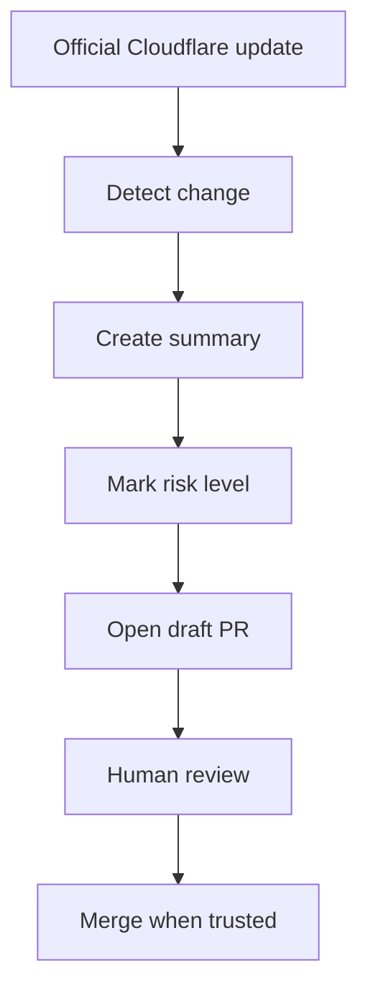

# Cloudflare Update System

Cloudflare changes often. This repository must stay current without becoming unsafe.

## Simple goal

When Cloudflare releases something new, this repo should notice it and prepare a reviewable update.

It should **not** silently change trusted guidance.

## What to watch

The update system should monitor official sources only:

- Cloudflare developer documentation
- Cloudflare changelog
- Cloudflare blog
- Wrangler releases
- Cloudflare GitHub repositories when relevant

## Safe update flow

## What every update PR must include

- What changed
- Which Cloudflare product is affected
- Beginner explanation
- Advanced explanation
- Breaking change risk
- Migration steps if needed
- Source links
- Checked date

## Risk levels

| Level | Meaning | Action |
| --- | --- | --- |
| Low | Small docs/example improvement | Review normally |
| Medium | Behavior, command, or recommendation changed | Test before merge |
| High | Breaking change, deprecation, pricing, security, or runtime change | Human review required |

## What AI may do

AI may:

- Summarize official changes
- Suggest doc updates
- Suggest prompt updates
- Create draft PRs
- Mark unclear areas for review

AI must not:

- Automatically merge update PRs
- Invent Cloudflare features
- Treat preview features as production-safe by default
- Hide uncertainty

## Beginner rule

If a Cloudflare feature is new, experimental, beta, or confusing, the repo must say so clearly.

Never make a beginner think an advanced or unstable feature is required for a simple project.
