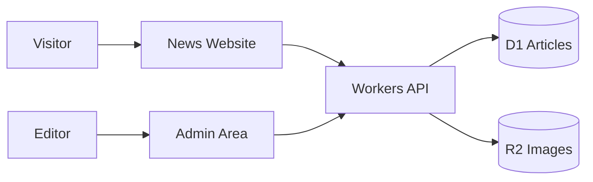

# Project Request Flow

Use this when someone asks for a project, for example:

> I need to develop a news portal.

The user may be a beginner. Start with simple next steps before advanced architecture.

## Answer format

### 1. Confirm the project

Say the goal in simple words.

Example:

> You want to build a news portal. Version 1 should publish articles, show categories, upload images, and give editors a simple admin area.

### 2. Show the smallest useful version

For a news portal, version 1 can include:

- Homepage
- Article page
- Category page
- Admin post editor
- Image upload
- Basic SEO fields
- Cloudflare deployment

### 3. Choose Cloudflare tools

| Need | Cloudflare tool |
| --- | --- |
| Website | Pages or Workers |
| Backend/API | Workers |
| Articles | D1 |
| Images | R2 |
| Admin protection | Access or login |
| Form protection | Turnstile |
| Background tasks later | Queues |
| Logs and analytics | Workers Logs and Web Analytics |

### 4. Give beginner steps

1. Create the project.
2. Build the public pages.
3. Create D1 tables.
4. Build admin create/edit pages.
5. Add image upload to R2.
6. Add basic security.
7. Test locally.
8. Deploy to Cloudflare.
9. Add advanced features later.

### 5. Ask only useful questions

Ask at most 3 questions.

Good questions:

- Bangla, English, or both?
- One admin or many authors?
- Should version 1 include comments?

Do not ask many questions before helping.

### 6. Starter diagram

### 7. Do not overbuild first

For version 1, avoid:

- Mobile app
- Complex newsroom workflow
- Paid subscription
- Large analytics system
- Multi-tenant SaaS mode

Add these after the simple version works.
