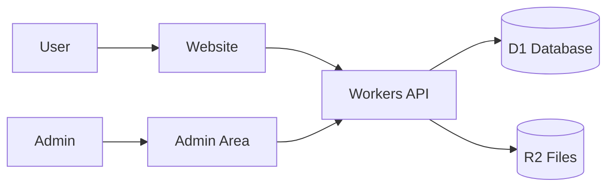

# Project Playbook: <Project Name>

Use this when someone says:

> I need to develop <project type>.

## Simple goal

Explain the project in one or two very simple sentences.

## Version 1 only

List the smallest useful version. Keep this short and realistic.

- Feature 1
- Feature 2
- Feature 3

## Do not build these first

Protect the beginner from overbuilding.

- Advanced feature 1
- Advanced feature 2
- Advanced feature 3

## Cloudflare tools

| Need | Cloudflare tool | Beginner reason |
| --- | --- | --- |
| Website | Pages or Workers | Shows the public site |
| Backend/API | Workers | Handles app logic |
| Database | D1 | Stores main app data |
| Files | R2 | Stores uploads and media |
| Cache | KV | Stores simple fast data when needed |
| Background tasks | Queues | Runs slow work later |
| Admin protection | Access or login | Keeps private area safe |
| Form protection | Turnstile | Reduces spam |

## Beginner architecture



## First database tables

Keep table design simple.

```text
main_table
- id
- name
- status
- created_at
- updated_at
```

## First folder structure

```text
project-name/
├── app/
├── worker/
├── db/
│   └── migrations/
├── public/
├── wrangler.toml
└── README.md
```

## Build steps

1. Create the project.
2. Build the public pages.
3. Create the database tables.
4. Build the API.
5. Build the admin area.
6. Add upload or form features.
7. Add security.
8. Test locally.
9. Deploy to Cloudflare.
10. Add advanced features later.

## Important beginner choices

Ask at most three important questions.

1. Question one?
2. Question two?
3. Question three?

## Version 2 ideas

Only after version 1 works:

- Improvement 1
- Improvement 2
- Improvement 3

## AI agent instruction

Do not add advanced services until version 1 works. Explain each step simply. Prefer working small features over large unfinished architecture.
